# Open30 Research

[Project site](https://mospira.github.io/ml-open30/) |
[Research report](https://mospira.github.io/ml-open30/research_report/)

A reproducible research stack for a 30-minute open-session equity
strategy. This contains the data pipeline, feature and label logic,
walk-forward backtest code, architecture manifests, and curated result artifacts.

## Repository Map

- `architectures/`: versioned strategy manifests
- `configs/`: pipeline, feature, and label configuration
- `src/`: ingestion, canonicalization, feature, label, modeling, and backtest code
- `run_pipeline.py`: raw data to assembled modeling dataset
- `run_backtest.py`: rolling walk-forward retraining and simulation
- `run_retrain_latest.py`: local model bundle export
- `results/`: curated result artifacts tracked for the public showcase
- `reports/`: generated full report outputs
- `models/`: generated model bundles
- `site/`: GitHub Pages source for the report

## Research Flow

The research workflow at the level used for experiment
planning and review. For script-level dependencies, see
[docs/DEPENDENCY_GRAPH.md](docs/DEPENDENCY_GRAPH.md).

```mermaid
flowchart LR
  manifest["Architecture manifest<br/>architectures/open30_v2.yaml<br/>or v1_x.yaml"]

  subgraph build["Data and Label Build"]
    bars["1m bars<br/>data/raw/candles_1m.parquet"]
    news["Daily news<br/>data/raw/news_daily/*.parquet"]
    sentiment["Canonical sentiment<br/>data/interim/canonical/sentiment_scores.parquet"]
    features["Feature modules<br/>daily, open, market, sentiment"]
    feature_table["Feature table<br/>data/processed/features_table.parquet"]
    instances["Trade instances<br/>(date, ticker, side)"]
    labels["Target labels<br/>y_type, y_R, hit minute, ambiguity"]
    dataset["Model dataset<br/>data/processed/dataset_open30m.parquet"]
  end

  subgraph backtest["Walk-Forward Backtest"]
    window["Rolling train window<br/>lookback, step, embargo"]
    train["Train XGBoost heads<br/>long-side training rows"]
    calibrate["Calibrate probabilities<br/>isotonic regression"]
    score["Score daily candidates<br/>probabilities and EV"]
    head_winners["Select per-head winners<br/>reward multiples"]
    selector{"Selection mode"}
    meta["Meta expected-return selector<br/>open30_v2"]
    raw_ev["Raw EV selector<br/>open30_v1 and v1_x"]
    trade_gate{"Eligible trade?"}
    sizing["Buying-power sizing<br/>1x, 2x, or 4x policy"]
    daily["Daily account record"]
  end

  subgraph review["Research Review Outputs"]
    metrics["summary_metrics.csv"]
    trades["*_trades.csv and *_daily.csv"]
    curves["equity_curves.csv<br/>rolling_pnl_chart.png"]
    reliability["*_reliability.csv/png"]
    mix["head_selection_mix.csv"]
    metadata["run_metadata.json<br/>architecture_manifest.json"]
  end

  subgraph export["Local Bundle Export"]
    retrain["run_retrain_latest.py"]
    bundle["models/live/YYYYMMDD/*<br/>model heads, calibrators, config"]
    latest["latest.json"]
  end

  manifest --> labels
  manifest --> window
  manifest --> selector
  manifest --> retrain

  bars --> features
  news --> sentiment
  sentiment --> features
  features --> feature_table
  features --> instances
  bars --> labels
  instances --> labels
  feature_table --> dataset
  instances --> dataset
  labels --> dataset

  dataset --> window
  window --> train
  train --> calibrate
  calibrate --> score
  score --> head_winners
  head_winners --> selector
  selector --> meta
  selector --> raw_ev
  meta --> trade_gate
  raw_ev --> trade_gate
  trade_gate -->|yes| sizing
  trade_gate -->|no| daily
  sizing --> daily

  daily --> metrics
  daily --> trades
  daily --> curves
  daily --> reliability
  daily --> mix
  window --> metadata

  dataset --> retrain
  retrain --> bundle
  bundle --> latest
```



## Setup

```bash
python -m venv .venv
.venv\Scripts\activate
pip install -r requirements.txt
copy .env.example .env
```

Fill `ALPHAVANTAGE_API_KEY` in `.env` if you want to rerun ingestion. `.env` is ignored.

Docker is also available:

```bash
docker compose run --rm research
```

## Reproducibility

This repository is set up so the tracked results can be regenerated from the
pipeline code and architecture manifests. The public export itself did not
rerun the pipeline or backtests.

The canonical modeling artifact is:

```text
data/processed/dataset_open30m.parquet
```

If you do not want to rerun ingestion and feature generation, download the
hosted dataset from Hugging Face and place `dataset_open30m.parquet` at that
path:

[mospira/open30-equity-features](https://huggingface.co/datasets/mospira/open30-equity-features)

To rebuild the artifact locally instead, run:

```bash
python run_pipeline.py --architecture architectures/open30_v2.yaml
```

The public pipeline config starts ingestion on `2010-02-02`. After feature
warm-up, the main tracked full-history backtest artifacts begin on
`2011-10-06`.

If only labels or stop geometry changed, rebuild labels and the final dataset
with the same architecture that will be backtested.

Canonical multi-head experiment:

```bash
python run_backtest.py --architecture architectures/open30_v2.yaml
```

Stronger single-head v1.x branch:

```bash
python run_backtest.py --architecture architectures/v1_3.yaml
```

ATR stop-distance sweep:

```bash
python run_v1_stop_distance_sweep.py
```

Generated outputs are written under `reports/` and are ignored by Git. Curated
outputs can be promoted manually into `results/` after review.

For each regenerated result, compare:

- `summary_metrics.csv`
- `run_metadata.json`
- `architecture_manifest.json`
- `head_selection_mix.csv`
- `equity_curves.csv`
- selected reliability CSVs and charts

Do not treat two runs as comparable unless they use the same dataset artifact,
date range, architecture manifest, starting capital, retrain schedule, embargo,
dynamic feature setting, meta-model setting, and realized-cost treatment.


## Research Ideas

Near-term work:

1. Deduct realized execution costs and test delayed-entry/slippage scenarios.
2. Promote a fixed long EV floor around `0.10` and compare it with a more
   conservative `0.20` setting on fresh data.
3. Train and validate a separate short-only model with stricter EV gating.
4. Replace the fixed top-25 universe with point-in-time membership and a
   broader liquidity screen.
5. Test staggered retrain consensus to reduce retrain-calendar phase risk.
6. Use cross-fitted calibration and threshold objectives based on daily net
   return or expected log growth.
7. Test stop distance and holding horizon jointly as separate candidate heads.

Lower-priority work:

- Direct return regression and pairwise ranker variants did not beat the
  classifier/EV design in the current controlled experiments.
- Heavier model families should wait until cost modeling, universe bias,
  calibration, and retrain stability are improved.

## Disclaimer

This repository is for research and educational use only. It is not financial
advice, investment advice, or a recommendation to trade any security.

Backtest results are historical simulations. They can be materially affected by
data quality, survivorship bias, transaction costs, slippage, borrow
availability, order timing, market regime changes, and implementation details.
Past simulated performance does not imply future performance.

The main research risks are:

- Fixed present-day top-25 universe can introduce survivorship and concentration
  bias.
- Realized backtest PnL does not yet deduct all execution costs and delayed-fill
  slippage scenarios.
- Entry labels assume the exact `09:31` open; live execution may arrive later.
- Isotonic calibration, early stopping, feature selection, and threshold tuning
  reuse adjacent held-out slices in ways that should be tightened.
- Dynamic threshold objectives can reward skipping more days rather than
  maximizing daily net return.
- Retrain-calendar phase sensitivity is material for some variants.
- Some account-equity curves are highly sensitive to starting capital and
  margin policy, so trade-level metrics are often safer for comparison.

The improvement audit in `results/improvement_audit/IMPROVEMENT_AUDIT.md`
prioritizes cost modeling, point-in-time universe construction, short-side
validation, staggered retrain consensus, and cross-fitted calibration.
