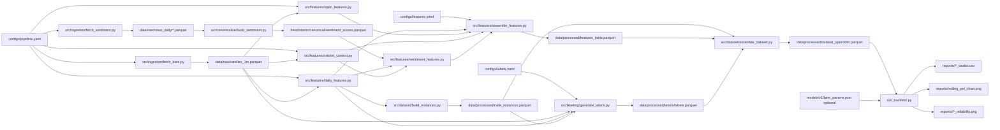
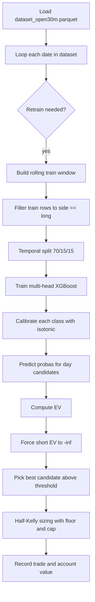
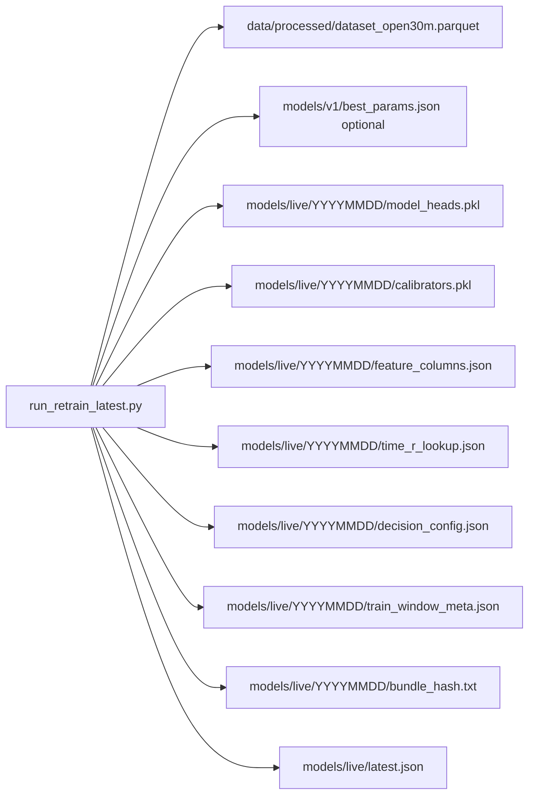

# Dependency Graph

This graph reflects the current implementation in this repository.

## 1) Execution graph

```mermaid
flowchart TD
  A[run_pipeline.py] --> B[src/ingestion/fetch_bars.py]
  A --> C[src/ingestion/fetch_sentiment.py]
  A --> D[src/canonicalize/build_sentiment.py]
  A --> E[src/features/daily_features.py]
  A --> F[src/features/open_features.py]
  A --> G[src/features/market_context.py]
  A --> H[src/features/sentiment_features.py]
  A --> I[src/features/assemble_features.py]
  A --> J[src/dataset/build_instances.py]
  A --> K[src/labeling/generate_labels.py]
  A --> L[src/dataset/assemble_dataset.py]

  B --> R1[data/raw/candles_1m.parquet]
  C --> R2[data/raw/news_daily/*.parquet]
  D --> R3[data/interim/canonical/sentiment_scores.parquet]
  E --> R4[data/processed/features/daily_features.parquet]
  F --> R5[data/processed/features/open_features.parquet]
  G --> R6[data/processed/features/market_context.parquet]
  H --> R7[data/processed/features/sentiment_features.parquet]
  I --> R8[data/processed/features_table.parquet]
  J --> R9[data/processed/trade_instances.parquet]
  K --> R10[data/processed/labels/labels.parquet]
  L --> R11[data/processed/dataset_open30m.parquet]
```

## 2) Artifact dependency graph

## 3) Backtest internal flow (current code path)

## Notes

- In `run_pipeline.py`, category flags skip whole categories, but remaining steps are executed with `force_fresh=True`.
- In `run_backtest.py`, evaluation currently runs on the full assembled dataset timeline.
- Current implemented calibration is isotonic regression.

## 4) Local bundle export flow

