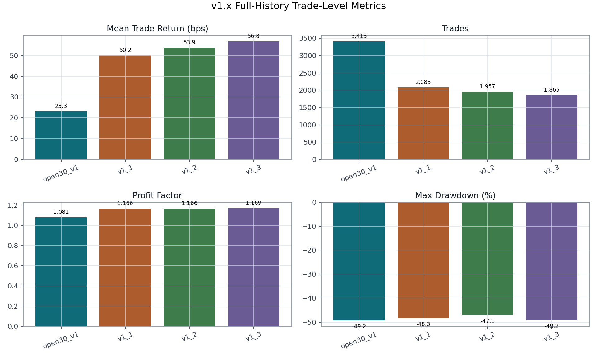
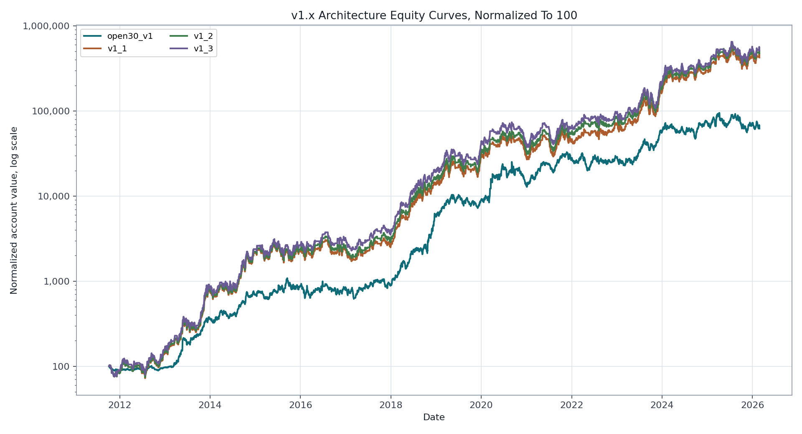
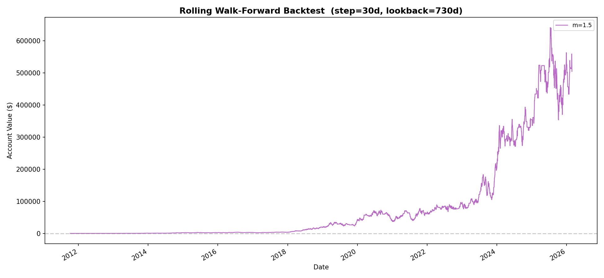
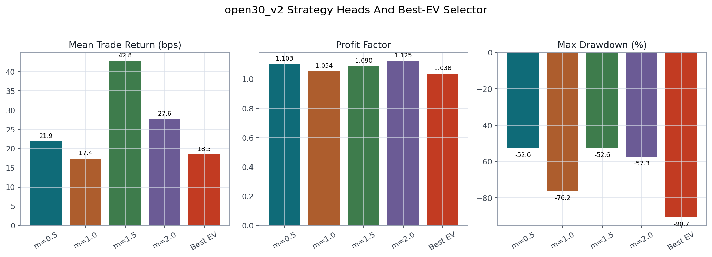
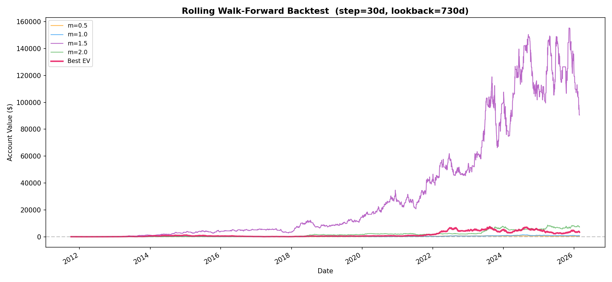
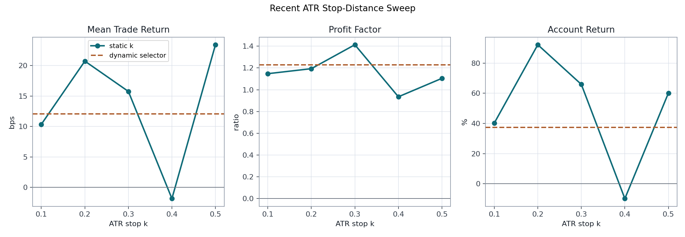
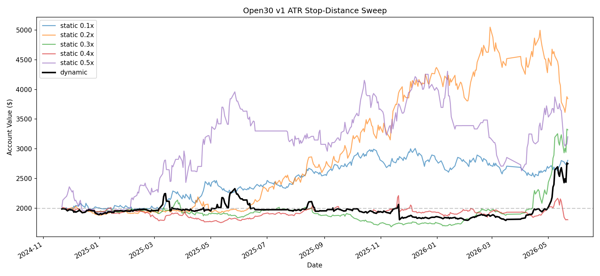

# Open30 Research Report

<p class="lede">This report summarizes the research problem, methodology,
walk-forward validation design, tracked results, limitations, and next
experiments for the Open30 strategy research stack.</p>

<div class="callout">
This is research and education only. It is not financial advice or a
recommendation to trade. Backtest results are historical simulations and are
sensitive to data, costs, execution timing, and implementation details.
</div>

## Summary

Open30 studies whether opening-session price action, prior daily context,
market alignment, and news sentiment can identify a favorable 30-minute trade
candidate after the market open. The current research stack builds candidate
rows keyed by `(date, ticker, side)`, labels take-profit, stop-loss, and time
exit outcomes, then evaluates model decisions with rolling walk-forward
training.

The strongest tracked full-history single-head branch is `v1_3`. It traded
1,865 days, averaged 56.82 bps per selected trade, and had a 1.169 profit
factor in the tracked artifact. The improvement audit finds that this edge is
execution-sensitive and should be hardened with realized cost modeling,
delayed-fill tests, point-in-time universe construction, and stronger
calibration.

## Problem Statement

The strategy asks this: shortly after the open, is there one
liquid large-cap equity candidate with enough expected return to justify a
short-horizon trade through the first 30 minutes?

The research version evaluates candidates using historical minute bars, daily
features, market context, and sentiment features. It does not claim a deployable
trading system by itself.

## Data And Universe

The pipeline expects:

- 1-minute bars at `data/raw/candles_1m.parquet`.
- Daily news files under `data/raw/news_daily/`.
- A tracked top-25 universe file at `data/interim/canonical/universe_top25.json`.
- Generated features, instances, labels, and final dataset under
  `data/processed/`.

The tracked result metadata records 195,166 dataset rows and 3,983 trading days
for the main full-history runs. The public pipeline config starts ingestion on
`2010-02-02`; feature warm-up means the main tracked backtest rows begin on
`2011-10-06`. The fixed present-day top-25 universe is a known risk because it
can overstate historical performance through survivorship and concentration
effects.

## Strategy Definition

The core strategy invariants are:

- Candidate rows are built per `(date, ticker, side)`.
- Entry is the `09:31` open.
- Take-profit and stop-loss scanning runs from `09:31` through `09:59`.
- The time-exit proxy is the `09:59` close.
- Class mapping is `0=SL`, `1=TP`, `2=TIME`.
- Ambiguous rows are converted to worst case before simulation and scoring.
- Current canonical execution is long-only at decision time.
- At most one trade is selected per day in the canonical backtest.

The architecture manifests in `architectures/` control reward multiples,
selection mode, training window, retrain cadence, embargo, calibration, stop
distance, EV thresholds, and position sizing.

## Methodology

The pipeline builds features in stages:

1. Fetch minute bars and news sentiment.
2. Canonicalize sentiment to daily ticker-level records.
3. Build daily, open-window, market-context, and sentiment features.
4. Assemble feature rows keyed by `(date, ticker)`.
5. Build candidate trade instances keyed by `(date, ticker, side)`.
6. Generate labels for reward multiples.
7. Assemble `data/processed/dataset_open30m.parquet`.

The backtest uses rolling walk-forward retraining with a 730-day lookback,
30-day retrain step, and 1-day embargo in the tracked full-history artifacts.
Training currently uses long-side rows unless an experiment deliberately changes
that policy. Probability calibration uses isotonic regression.

## Architecture Versions

| Architecture | Purpose |
|---|---|
| `open30_v1` | Raw-EV baseline centered on `m=1.5`. |
| `v1_1` | Single-head `m=1.5` with dynamic EV threshold tuning. |
| `v1_2` | Tightens the dynamic threshold grid by removing low values. |
| `v1_3` | Raises the minimum dynamic threshold to `0.075`. |
| `open30_v2` | Multi-head XGBoost setup with an expected-return meta selector. |

## Results

### Single-Head v1.x Branch

Account curves are sensitive to starting capital and margin policy. The table
therefore emphasizes trade-level metrics. `open30_v1` also used a different
starting capital from `v1_1` through `v1_3`, so account return should not be
read as a clean architecture comparison.

| Architecture | Trades | Mean trade return | Profit factor | Max drawdown |
|---|---:|---:|---:|---:|
| `open30_v1` | 3,413 | 23.28 bps | 1.081 | -49.24% |
| `v1_1` | 2,083 | 50.22 bps | 1.166 | -48.31% |
| `v1_2` | 1,957 | 53.90 bps | 1.166 | -47.11% |
| `v1_3` | 1,865 | 56.82 bps | 1.169 | -49.16% |



The metric comparison highlights the central v1.x tradeoff: the threshold
variants select fewer trades, but the selected-trade return and profit factor
improve relative to the raw baseline.



The normalized equity chart puts the v1.x variants on the same starting value.
It uses a log scale because account values compound across a wide range.



The threshold variants reduced trade count while improving mean selected-trade
return. Drawdowns remain large, so this is not yet a robust production claim.

### Multi-Head v2

The multi-head expected-return selector did not beat the stronger single-head
branch in the tracked artifacts.

| Strategy | Trades | Mean trade return | Profit factor | Max drawdown |
|---|---:|---:|---:|---:|
| `m=0.5` | 873 | 21.89 bps | 1.103 | -52.60% |
| `m=1.0` | 2,089 | 17.40 bps | 1.054 | -76.25% |
| `m=1.5` | 1,972 | 42.83 bps | 1.090 | -52.60% |
| `m=2.0` | 2,080 | 27.65 bps | 1.125 | -57.29% |
| `Best EV` | 3,254 | 18.50 bps | 1.038 | -90.66% |



The `m=1.5` head had the best mean trade return in this v2 run, while the
`Best EV` selector increased trade count but had the weakest drawdown profile.



### Stop-Distance Sweep

The stop-distance sweep covers a shorter recent period, from 2024-11-21 through
2026-05-22. It should be read as an experiment about stop geometry, not as a
full-history replacement for the v1.x branch.

| Mode | Stop k | Trades | Mean trade return | Profit factor | Return |
|---|---:|---:|---:|---:|---:|
| static | 0.1 | 364 | 10.35 bps | 1.147 | 40.23% |
| static | 0.2 | 358 | 20.72 bps | 1.193 | 92.20% |
| static | 0.3 | 358 | 15.75 bps | 1.413 | 65.91% |
| static | 0.4 | 346 | -1.84 bps | 0.935 | -9.84% |
| static | 0.5 | 287 | 23.41 bps | 1.104 | 60.12% |
| dynamic | n/a | 317 | 12.07 bps | 1.228 | 37.45% |



The recent stop sweep shows unstable stop-distance behavior: `k=0.2` had the
highest account return over this window, while `k=0.3` had the highest profit
factor. The dynamic selector did not dominate the static settings.



## Improvement Audit

The improvement audit concluded that the long-only `m=1.5` edge is real enough
to continue researching, but very sensitive to execution assumptions. The most
important tested improvements were:

- Use a fixed, cost-aware EV floor near `0.10` for the long strategy.
- Train a separate short-only model with a stricter EV floor near `0.25`.
- Deduct realistic costs and slippage from realized backtest PnL.
- Replace the fixed present-day top-25 universe with point-in-time membership.
- Explore staggered retrain consensus before heavier model families.

## Reproducibility

The public export did not rerun pipelines. To reproduce results locally:

```bash
python run_pipeline.py --architecture architectures/open30_v2.yaml
python run_backtest.py --architecture architectures/open30_v2.yaml
python run_backtest.py --architecture architectures/v1_3.yaml
python run_v1_stop_distance_sweep.py
```

Generated outputs are written to `reports/`. Curated outputs in `results/` are
reviewed snapshots copied from those generated reports.

## Limitations

These are the main blockers before treating results as production-ready:

- Fixed present-day top-25 universe may introduce survivorship bias.
- Realized PnL does not yet fully model costs, slippage, and delayed fills.
- Labels assume the exact `09:31` open.
- Calibration and threshold tuning need stricter cross-fitting.
- Dynamic threshold objectives can favor low trade counts rather than daily
  net return.
- Retrain-calendar phase sensitivity can materially change outcomes.
- Ticker and head concentration remain meaningful.

## Next Research Direction

The next high-value work is to make the simulation more execution-aware,
rebuild the universe point-in-time, and then retest the simpler `m=1.5`
classifier/EV design with fixed cost-aware thresholds before promoting more
complex model families.
